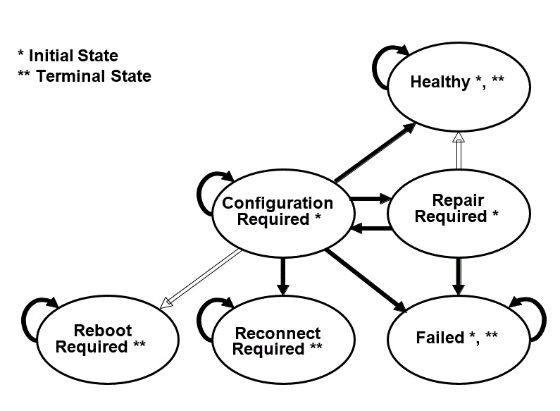

<!--- @file
  14.2 GetHealthStatus() Implementations

  Copyright (c) 2012-2018, Intel Corporation. All rights reserved.<BR>

  Redistribution and use in source (original document form) and 'compiled'
  forms (converted to PDF, epub, HTML and other formats) with or without
  modification, are permitted provided that the following conditions are met:

  1) Redistributions of source code (original document form) must retain the
     above copyright notice, this list of conditions and the following
     disclaimer as the first lines of this file unmodified.

  2) Redistributions in compiled form (transformed to other DTDs, converted to
     PDF, epub, HTML and other formats) must reproduce the above copyright
     notice, this list of conditions and the following disclaimer in the
     documentation and/or other materials provided with the distribution.

  THIS DOCUMENTATION IS PROVIDED BY TIANOCORE PROJECT "AS IS" AND ANY EXPRESS OR
  IMPLIED WARRANTIES, INCLUDING, BUT NOT LIMITED TO, THE IMPLIED WARRANTIES OF
  MERCHANTABILITY AND FITNESS FOR A PARTICULAR PURPOSE ARE DISCLAIMED. IN NO
  EVENT SHALL TIANOCORE PROJECT  BE LIABLE FOR ANY DIRECT, INDIRECT, INCIDENTAL,
  SPECIAL, EXEMPLARY, OR CONSEQUENTIAL DAMAGES (INCLUDING, BUT NOT LIMITED TO,
  PROCUREMENT OF SUBSTITUTE GOODS OR SERVICES; LOSS OF USE, DATA, OR PROFITS;
  OR BUSINESS INTERRUPTION) HOWEVER CAUSED AND ON ANY THEORY OF LIABILITY,
  WHETHER IN CONTRACT, STRICT LIABILITY, OR TORT (INCLUDING NEGLIGENCE OR
  OTHERWISE) ARISING IN ANY WAY OUT OF THE USE OF THIS DOCUMENTATION, EVEN IF
  ADVISED OF THE POSSIBILITY OF SUCH DAMAGE.

-->

## 14.2 GetHealthStatus() Implementations

The `GetHealthStatus()` service retrieves the health status for a controller a
driver is managing or a child the driver has produced. This service is not
allowed to use any of the console I/O related protocols. Instead, the health
status information is returned to the caller. The caller may choose to log or
display the health status information. The example below shows an empty
implementation of the `GetHealthStatus()` service for the Driver Health
Protocol.

###### Example 152-GetHealthStatus() Function of the Driver Health Protocol

```c
#include <Uefi.h>
#include <Protocol/DriverHealth.h>

EFI_STATUS
EFIAPI
AbcGetHealthStatus (
  IN  EFI_DRIVER_HEALTH_PROTOCOL     *This,
  IN  EFI_HANDLE                     ControllerHandle,  OPTIONAL
  IN  EFI_HANDLE                     ChildHandle,       OPTIONAL
  OUT EFI_DRIVER_HEALTH_STATUS       *HealthStatus,
  OUT EFI_DRIVER_HEALTH_HII_MESSAGE  **MessageList,     OPTIONAL
  OUT EFI_HII_HANDLE                 *FormHiiHandle     OPTIONAL
  )
{
}
```

_HealthStatus_ is the return parameter reporting the status for the controller
specified by _ControllerHandle_ and _ChildHandle_. Descriptions of the various
health status values returned in _HealthStatus_ follow.

<div style="page-break-after: always;"></div>

###### Table 23-Health Status Values

| **Health Status Name** | **Definition** |
| ---------------------- | -------------- |
| EfiDriverHealthStatu sHealthy | The controller is in a healthy state.  |
| EfiDriverHealthStatu sRepairRequired | The controller requires a repair operation taking an extended period of time to perform. The UEFI Boot Manager is required to call the Repair() function when this state is detected. |
| EfiDriverHealthStatu sConfigurationRequired | The controller requires the user to make software or hardware configuration changes in order to put the controller into a healthy state. The set of software configuration changes are specified by the FormHiiHandle parameter. The EFI Boot Manager may call the EFI_FORM_BROWSER2_PROTOCOL.SendForm() function to display configuration information and allow the user to make the required configuration changes. The HII form is the first enabled form in the form set class EFI_HII_DRIVER_HEALTH_FORMSET_GUID, which is installed on the returned HII handle FormHiiHandle. |
| EfiDriverHealthStatusFailed | The controller is in a failed state and there are no actions that can place the controller into a healthy state. This controller, nor no any boot devices behind it, cannot be used as a boot device. |
| EfiDriverHealthStatu sReconnectRequired  | A hardware and/or software configuration change was performed by the user and the controller needs to be reconnected before the controller can be placed in a healthy state. The UEFI Boot Manager is required to call the UEFI Boot Service DisconnectController(), followed by the UEFI Boot Service ConnectController(), to reconnect the controller. |
| EfiDriverHealthStatu sRebootRequired  | A hardware and/or software configuration change was performed by the user and the controller requires the entire platform to be rebooted before the controller can be placed in a healthy state. The UEFI Boot Manager should complete the configuration and repair operations on all the controllers that are not in a healthy state before rebooting the system. |

Depending on the specific health status value returned, additional information
may be returned in _MessageList_ and _FormHiiHandle_ as described in the table
above. The health status for devices is typically stored in the private context
data structure. The Driver Binding Protocol `Start()` function for a UEFI
Driver is usually where the health status for a device is initially detected
and the results of that detection logic are stored in the private context data
structure. As the UEFI Boot Manager performs repair or configuration actions,
the health status of a controller changes. Each time `GetHealthStatus()` is called, the health status of the controller must be evaluated. The EFI Driver Health Protocol section of the _UEFI Specification_ defines the legal state transitions for health status values as shown in the
following figure.

<div style="page-break-after: always;"></div>

###### Figure 18-Driver Health Status State Diagram



The Driver Health Protocol is only available for devices a driver is currently
managing. Because UEFI supports connecting the minimum number of drivers and
devices required to establish console and gain access to the boot device, there
may be many unconnected devices that support The Driver Health Protocol. As a
result, when the user wishes to enter a platform configuration mode, the UEFI
Boot Manager must connect all drivers to all devices so the UEFI Boot Manager
can evaluate the health status of all the devices in the platform supporting
the Driver Health Protocol.
