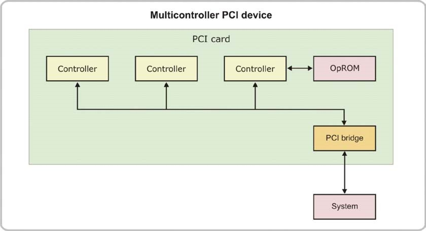

<!--- @file
  18.3.3 PCI Cards with Multiple PCI Controllers

  Copyright (c) 2012-2018, Intel Corporation. All rights reserved. 

  Redistribution and use in source (original document form) and 'compiled'
  forms (converted to PDF, epub, HTML and other formats) with or without
  modification, are permitted provided that the following conditions are met:

  1) Redistributions of source code (original document form) must retain the
     above copyright notice, this list of conditions and the following
     disclaimer as the first lines of this file unmodified.

  2) Redistributions in compiled form (transformed to other DTDs, converted to
     PDF, epub, HTML and other formats) must reproduce the above copyright
     notice, this list of conditions and the following disclaimer in the
     documentation and/or other materials provided with the distribution.

  THIS DOCUMENTATION IS PROVIDED BY TIANOCORE PROJECT "AS IS" AND ANY EXPRESS OR
  IMPLIED WARRANTIES, INCLUDING, BUT NOT LIMITED TO, THE IMPLIED WARRANTIES OF
  MERCHANTABILITY AND FITNESS FOR A PARTICULAR PURPOSE ARE DISCLAIMED. IN NO
  EVENT SHALL TIANOCORE PROJECT  BE LIABLE FOR ANY DIRECT, INDIRECT, INCIDENTAL,
  SPECIAL, EXEMPLARY, OR CONSEQUENTIAL DAMAGES (INCLUDING, BUT NOT LIMITED TO,
  PROCUREMENT OF SUBSTITUTE GOODS OR SERVICES; LOSS OF USE, DATA, OR PROFITS;
  OR BUSINESS INTERRUPTION) HOWEVER CAUSED AND ON ANY THEORY OF LIABILITY,
  WHETHER IN CONTRACT, STRICT LIABILITY, OR TORT (INCLUDING NEGLIGENCE OR
  OTHERWISE) ARISING IN ANY WAY OUT OF THE USE OF THIS DOCUMENTATION, EVEN IF
  ADVISED OF THE POSSIBILITY OF SUCH DAMAGE.

-->

### 18.3.3 PCI Cards with Multiple PCI Controllers

Some PCI devices have a series of identical devices on a single device,
normally behind a PCI bridge. These devices may require additional work if they
need to be controlled by a single instance of the UEFI driver. Take the
following figure as a sample device.

###### Figure 20-A multi-controller PCI device

It may be required that the driver in the Option ROM control all 3 controllers
on the PCI device. To do this, use the following actions:
* In the `Supported()` function, make sure that the UEFI Driver supports the
  controller that is passed into the `Support()` function. The first controller
  passed in could be any of the controllers on a PCI Card.
* In the `Supported()` function, make sure the function does not touch or
  change the HW state. _This is very important._ If the PCI I/O instance is
  already opened (if some other application or driver is already managing the
  controller), return an error. See _Chapter 9_ of this guide and the EFI
  Driver Binding Protocol section of the _UEFI Specification_ for details on
  the error return codes from the Driver Binding Protocol `Supported()`
  function.
* In the `Start()` function for the first controller on the PCI Card, open the
  PCI I/O protocol instances on the other handles on the same PCI Card using
  the `EFI_OPEN_PROTOCOL_BY_DRIVER` attribute. This informs all other UEFI
  Drivers in the platform that all the controllers on the PCI Card are already
  being managed.
  To scan for other PCI controllers on the same PCI Card, use the UEFI Boot
  Service LocateHandleBuffer() to find all handles in the Handle Database
  supporting the PCI I/O Protocol. Use the PCI I/O Protocol function
  GetLocation()to evaluate whether or not the PCI controller is on the same PCI
  bus number. Take care to not modify the HW state of any PCI I/O Protocol
  instance during this evaluation.
* In the `Stop()` function, undo everything that was done in `Start()`. Use a
  private context data structure to keep track of the information required to
  complete a `Stop()` operation in these more complex use cases.
