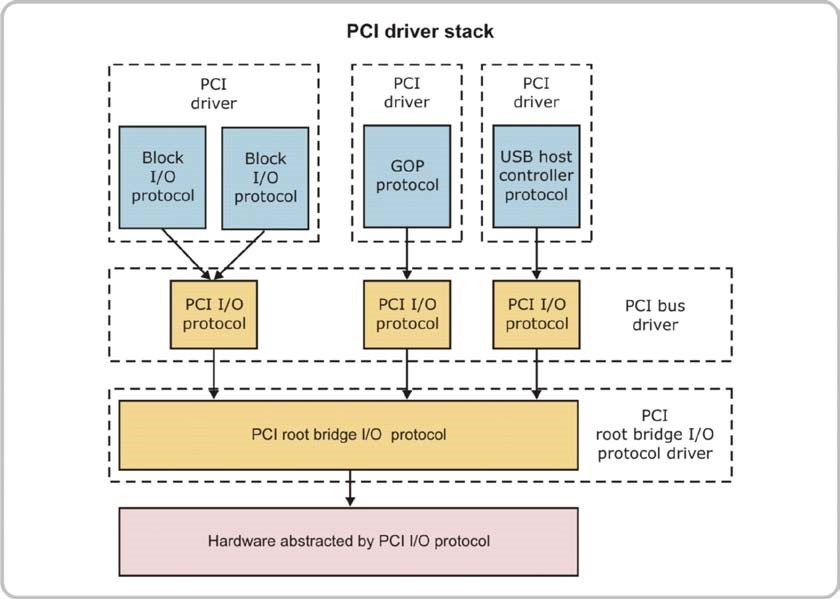

<!--- @file
  18 PCI Driver Design Guidelines

  Copyright (c) 2012-2018, Intel Corporation. All rights reserved. 

  Redistribution and use in source (original document form) and 'compiled'
  forms (converted to PDF, epub, HTML and other formats) with or without
  modification, are permitted provided that the following conditions are met:

  1) Redistributions of source code (original document form) must retain the
     above copyright notice, this list of conditions and the following
     disclaimer as the first lines of this file unmodified.

  2) Redistributions in compiled form (transformed to other DTDs, converted to
     PDF, epub, HTML and other formats) must reproduce the above copyright
     notice, this list of conditions and the following disclaimer in the
     documentation and/or other materials provided with the distribution.

  THIS DOCUMENTATION IS PROVIDED BY TIANOCORE PROJECT "AS IS" AND ANY EXPRESS OR
  IMPLIED WARRANTIES, INCLUDING, BUT NOT LIMITED TO, THE IMPLIED WARRANTIES OF
  MERCHANTABILITY AND FITNESS FOR A PARTICULAR PURPOSE ARE DISCLAIMED. IN NO
  EVENT SHALL TIANOCORE PROJECT  BE LIABLE FOR ANY DIRECT, INDIRECT, INCIDENTAL,
  SPECIAL, EXEMPLARY, OR CONSEQUENTIAL DAMAGES (INCLUDING, BUT NOT LIMITED TO,
  PROCUREMENT OF SUBSTITUTE GOODS OR SERVICES; LOSS OF USE, DATA, OR PROFITS;
  OR BUSINESS INTERRUPTION) HOWEVER CAUSED AND ON ANY THEORY OF LIABILITY,
  WHETHER IN CONTRACT, STRICT LIABILITY, OR TORT (INCLUDING NEGLIGENCE OR
  OTHERWISE) ARISING IN ANY WAY OUT OF THE USE OF THIS DOCUMENTATION, EVEN IF
  ADVISED OF THE POSSIBILITY OF SUCH DAMAGE.

-->

# 18 PCI Driver Design Guidelines

There are several categories of PCI drivers that cooperate to provide support
for PCI controllers in a platform. Table 25- lists these PCI drivers.

###### Table 25-Classes of PCI drivers

| **Class of driver**    | **Description**                                                                    |
| ---------------------- | ---------------------------------------------------------------------------------- |
| PCI root bridge driver | Produces one or more instances of the PCI Root Bridge I/O Protocol.                |
| PCI bus driver         | Consumes the PCI Root Bridge I/O Protocol, produces a child handle for each PCI controller, and installs the Device Path Protocol and the PCI I/O Protocol onto each child handle.  |
| PCI driver             | Consumes the PCI I/O Protocol and produces an I/O abstraction providing services for the console and boot devices required to boot an EFI-conformant operating system.        |

This chapter concentrates on the design and implementation of PCI drivers. PCI
drivers must follow all of the general design guidelines described in _Chapter
4_. This chapter covers guidelines that apply specifically to the management of
PCI controllers.

The following figure shows an example PCI driver stack and the protocols the
PCIrelated drivers consume and produce. In this example, the platform hardware
produces a single PCI root bridge. The PCI Root Bridge I/O Protocol driver
accesses the hardware resources to produce a single handle with the
`EFI_DEVICE_PATH_PROTOCOL` and the `EFI_PCI_ROOT_BRIDGE_IO_PROTOCOL`.

The PCI bus driver consumes the services of the `PCI_ROOT_BRIDGE_IO_PROTOCOL`
and uses those services to enumerate the PCI controllers present in the system.
In this example, the PCI bus driver detected a disk controller, a graphics
controller, and a USB host controller. As a result, the PCI bus driver produces
three child handles with the `EFI_DEVICE_PATH_PROTOCOL` and the
`EFI_PCI_IO_PROTOCOL`.
* The driver for the PCI disk controller consumes the services of the
  `EFI_PCI_IO_PROTOCOL` and produces two child handles with the
  `EFI_DEVICE_PATH_PROTOCOL` and the `EFI_BLOCK_IO_PROTOCOL`.
* The PCI driver for the graphics controller consumes the services of the
  `EFI_PCI_IO_PROTOCOL` and produces a child handle with the
  `EFI_GRAPHICS_OUTPUT_PROTOCOL`.
* The PCI driver for the USB host controller consumes the services of the
  `EFI_PCI_IO_PROTOCOL` to produce the `EFI_USB_HOST_CONTROLLER_PROTOCOL`.
  Although not shown in Figure 19, the `EFI_USB_HOST_CONTROLLER_PROTOCOL` would
  then be consumed by the USB bus driver to produce child handles for each USB
  device. USB drivers would then manage those child handles.

_Chapter 19_ contains the guidelines for designing USB drivers.

###### Figure 19-PCI driver stack

