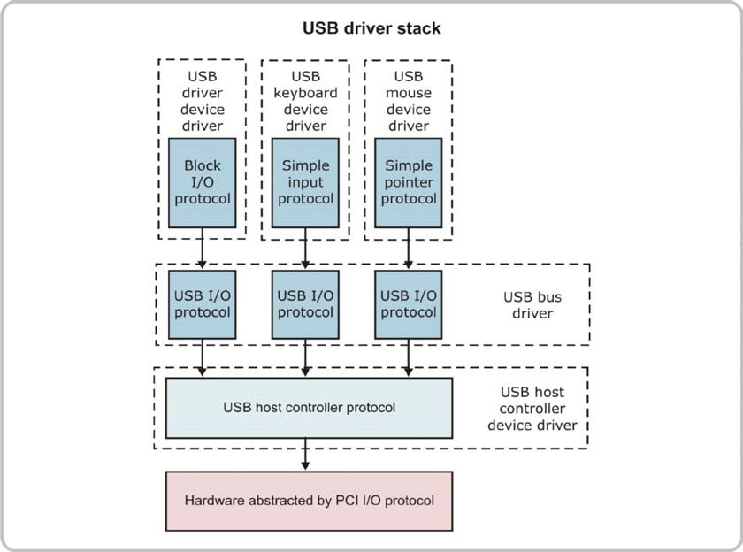

<!--- @file
  19 USB Driver Design Guidelines

  Copyright (c) 2012-2018, Intel Corporation. All rights reserved.<BR>

  Redistribution and use in source (original document form) and 'compiled'
  forms (converted to PDF, epub, HTML and other formats) with or without
  modification, are permitted provided that the following conditions are met:

  1) Redistributions of source code (original document form) must retain the
     above copyright notice, this list of conditions and the following
     disclaimer as the first lines of this file unmodified.

  2) Redistributions in compiled form (transformed to other DTDs, converted to
     PDF, epub, HTML and other formats) must reproduce the above copyright
     notice, this list of conditions and the following disclaimer in the
     documentation and/or other materials provided with the distribution.

  THIS DOCUMENTATION IS PROVIDED BY TIANOCORE PROJECT "AS IS" AND ANY EXPRESS OR
  IMPLIED WARRANTIES, INCLUDING, BUT NOT LIMITED TO, THE IMPLIED WARRANTIES OF
  MERCHANTABILITY AND FITNESS FOR A PARTICULAR PURPOSE ARE DISCLAIMED. IN NO
  EVENT SHALL TIANOCORE PROJECT  BE LIABLE FOR ANY DIRECT, INDIRECT, INCIDENTAL,
  SPECIAL, EXEMPLARY, OR CONSEQUENTIAL DAMAGES (INCLUDING, BUT NOT LIMITED TO,
  PROCUREMENT OF SUBSTITUTE GOODS OR SERVICES; LOSS OF USE, DATA, OR PROFITS;
  OR BUSINESS INTERRUPTION) HOWEVER CAUSED AND ON ANY THEORY OF LIABILITY,
  WHETHER IN CONTRACT, STRICT LIABILITY, OR TORT (INCLUDING NEGLIGENCE OR
  OTHERWISE) ARISING IN ANY WAY OUT OF THE USE OF THIS DOCUMENTATION, EVEN IF
  ADVISED OF THE POSSIBILITY OF SUCH DAMAGE.

-->

# 19 USB Driver Design Guidelines

There are several categories of USB drivers that cooperate to provide the USB
driver stack in a platform. The table below lists these USB drivers.

<div style="page-break-after: always;"></div>

###### Table 30-Classes of USB drivers

| **Class of driver**        | **Description**                                                                                                                                                                               |
| -------------------------- | --------------------------------------------------------------------------------------------------------------------------------------------------------------------------------------------- |
| USB host controller driver | Consumes PCI I/O Protocol on the USB host controller handle and produces the USB2 Host Controller Protocol.                                                                                   |
| USB bus driver             | Consumes the USB2 Host Controller Protocol and produces a child handle for each USB controller on the USB bus. Installs the Device Path Protocol and USB I/O Protocol onto each child handle. |
| USB device driver          | Consumes the USB I/O Protocol and produces an I/O abstraction that provides services for the console devices and boot devices required to boot an EFI-conformant operating system.            |

This chapter shows how to write host controller drivers and USB device drivers.
USB drivers must follow all of the general design guidelines described in
_Chapter 4_ of this guide. In addition, any USB host controllers that are PCI
controllers must also follow the PCI-specific design guidelines (see _Chapter
18_).

**********
**Note:** _USB device drivers do not typically include HII functionality
because they do not have configurable information. For example, USB device
drivers are typically for hot-plug devices._
**********

The figure below shows an example of a USB driver stack and the protocols
the USB drivers consume and produce. Because the USB hub is a special kind of
device that simply acts as a signal repeater, it is not included in Figure 21.

<div style="page-break-after: always;"></div>

###### Figure 21-USB driver stack



In this example, the platform hardware provides a single USB host controller on
the PCI bus. The PCI bus driver produces a handle with
`EFI_DEVICE_PATH_PROTOCOL` and `EFI_PCI_IO_PROTOCOL` installed for this USB
host controller. The USB host controller driver then consumes
`EFI_PCI_IO_PROTOCOL` on that USB host controller device handle and installs
the `EFI_USB2_HC_PROTOCOL` onto the same handle.

The USB bus driver consumes the services of `EFI_USB2_HC_PROTOCOL`. It uses
these services to enumerate the USB bus. In this example, the USB bus driver
detects a USB keyboard, a USB mouse, and a USB mass storage device. As a
result, the USB bus driver creates three child handles and installs the
`EFI_DEVICE_PATH_PROTOCOL` and `EFI_USB_IO_PROTOCOL` onto each of those handles.

The USB mouse driver consumes the `EFI_USB_IO_PROTOCOL` and produces the
`EFI_SIMPLE_POINTER_PROTOCOL`. The USB keyboard driver consumes the
`EFI_USB_IO_PROTOCOL` to produce the `EFI_SIMPLE_TEXT_INPUT_PROTOCOL`. The USB
mass storage driver consumes the `EFI_USB_IO_PROTOCOL` to produce the `EFI_USB_IO_PROTOCOL`.

The protocol interfaces for the USB2 Host Controller Protocol and the USB I/O
Protocol are shown below in the following two examples.

###### Example 202-USB 2 Host Controller Protocol

```c
typedef struct _EFI_USB2_HC_PROTOCOL EFI_USB2_HC_PROTOCOL;
///
/// The EFI_USB2_HC_PROTOCOL provides USB host controller management, basic
/// data transactions over a USB bus, and USB root hub access. A device driver
/// that wishes to manage a USB bus in a system retrieves the EFI_USB2_HC_PROTOCOL
/// instance that is associated with the USB bus to be managed. A device handle
/// for a USB host controller minimally contains an EFI_DEVICE_PATH_PROTOCOL
/// instance, and an EFI_USB2_HC_PROTOCOL instance.
///
struct _EFI_USB2_HC_PROTOCOL {
  EFI_USB2_HC_PROTOCOL_GET_CAPABILITY             GetCapability;
  EFI_USB2_HC_PROTOCOL_RESET                      Reset;
  EFI_USB2_HC_PROTOCOL_GET_STATE                  GetState;
  EFI_USB2_HC_PROTOCOL_SET_STATE                  SetState;
  EFI_USB2_HC_PROTOCOL_CONTROL_TRANSFER           ControlTransfer;
  EFI_USB2_HC_PROTOCOL_BULK_TRANSFER              BulkTransfer;
  EFI_USB2_HC_PROTOCOL_ASYNC_INTERRUPT_TRANSFER   AsyncInterruptTransfer;
  EFI_USB2_HC_PROTOCOL_SYNC_INTERRUPT_TRANSFER    SyncInterruptTransfer;
  EFI_USB2_HC_PROTOCOL_ISOCHRONOUS_TRANSFER       IsochronousTransfer;
  EFI_USB2_HC_PROTOCOL_ASYNC_ISOCHRONOUS_TRANSFER AsyncIsochronousTransfer;
  EFI_USB2_HC_PROTOCOL_GET_ROOTHUB_PORT_STATUS    GetRootHubPortStatus;
  EFI_USB2_HC_PROTOCOL_SET_ROOTHUB_PORT_FEATURE   SetRootHubPortFeature;
  EFI_USB2_HC_PROTOCOL_CLEAR_ROOTHUB_PORT_FEATURE ClearRootHubPortFeature;

  ///
  /// The major revision number of the USB host controller. The revision
  /// information indicates the release of the Universal Serial Bus Specification
  /// with which the host controller is compliant.
  ///
  UINT16                                          MajorRevision;

  ///
  /// The minor revision number of the USB host controller. The revision
  /// information indicates the release of the Universal Serial Bus Specification
  /// with which the host controller is compliant.
  ///
  UINT16                                          MinorRevision;
};
```

###### Example 203-USB I/O Protocol

```c
typedef struct _EFI_USB_IO_PROTOCOL EFI_USB_IO_PROTOCOL;

///
/// The EFI_USB_IO_PROTOCOL provides four basic transfers types described
/// in the USB 1.1 Specification. These include control transfer, interrupt
/// transfer, bulk transfer and isochronous transfer. The EFI_USB_IO_PROTOCOL
/// also provides some basic USB device/controller management and configuration
/// interfaces. A USB device driver uses the services of this protocol to manage
/// USB devices.
///
struct _EFI_USB_IO_PROTOCOL {
  //
  // IO transfer
  //
  EFI_USB_IO_CONTROL_TRANSFER              UsbControlTransfer;
  EFI_USB_IO_BULK_TRANSFER                 UsbBulkTransfer;
  EFI_USB_IO_ASYNC_INTERRUPT_TRANSFER      UsbAsyncInterruptTransfer;
  EFI_USB_IO_SYNC_INTERRUPT_TRANSFER       UsbSyncInterruptTransfer;
  EFI_USB_IO_ISOCHRONOUS_TRANSFER          UsbIsochronousTransfer;
  EFI_USB_IO_ASYNC_ISOCHRONOUS_TRANSFER    UsbAsyncIsochronousTransfer;

  //
  // Common device request
  //
  EFI_USB_IO_GET_DEVICE_DESCRIPTOR         UsbGetDeviceDescriptor;
  EFI_USB_IO_GET_CONFIG_DESCRIPTOR         UsbGetConfigDescriptor;
  EFI_USB_IO_GET_INTERFACE_DESCRIPTOR      UsbGetInterfaceDescriptor;
  EFI_USB_IO_GET_ENDPOINT_DESCRIPTOR       UsbGetEndpointDescriptor;
  EFI_USB_IO_GET_STRING_DESCRIPTOR         UsbGetStringDescriptor;
  EFI_USB_IO_GET_SUPPORTED_LANGUAGE        UsbGetSupportedLanguages;

  //
  // Reset controller's parent port
  //
  EFI_USB_IO_PORT_RESET UsbPortReset;
};
```
