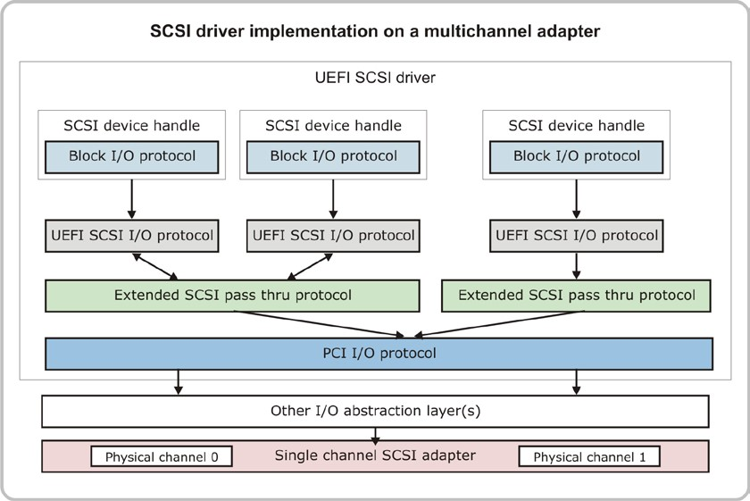

<!--- @file
  20.1.2 Multi-Channel SCSI Adapters

  Copyright (c) 2012-2018, Intel Corporation. All rights reserved. 

  Redistribution and use in source (original document form) and 'compiled'
  forms (converted to PDF, epub, HTML and other formats) with or without
  modification, are permitted provided that the following conditions are met:

  1) Redistributions of source code (original document form) must retain the
     above copyright notice, this list of conditions and the following
     disclaimer as the first lines of this file unmodified.

  2) Redistributions in compiled form (transformed to other DTDs, converted to
     PDF, epub, HTML and other formats) must reproduce the above copyright
     notice, this list of conditions and the following disclaimer in the
     documentation and/or other materials provided with the distribution.

  THIS DOCUMENTATION IS PROVIDED BY TIANOCORE PROJECT "AS IS" AND ANY EXPRESS OR
  IMPLIED WARRANTIES, INCLUDING, BUT NOT LIMITED TO, THE IMPLIED WARRANTIES OF
  MERCHANTABILITY AND FITNESS FOR A PARTICULAR PURPOSE ARE DISCLAIMED. IN NO
  EVENT SHALL TIANOCORE PROJECT  BE LIABLE FOR ANY DIRECT, INDIRECT, INCIDENTAL,
  SPECIAL, EXEMPLARY, OR CONSEQUENTIAL DAMAGES (INCLUDING, BUT NOT LIMITED TO,
  PROCUREMENT OF SUBSTITUTE GOODS OR SERVICES; LOSS OF USE, DATA, OR PROFITS;
  OR BUSINESS INTERRUPTION) HOWEVER CAUSED AND ON ANY THEORY OF LIABILITY,
  WHETHER IN CONTRACT, STRICT LIABILITY, OR TORT (INCLUDING NEGLIGENCE OR
  OTHERWISE) ARISING IN ANY WAY OUT OF THE USE OF THIS DOCUMENTATION, EVEN IF
  ADVISED OF THE POSSIBILITY OF SUCH DAMAGE.

-->

### 20.1.2 Multi-Channel SCSI Adapters

A SCSI host controller driver is more complex if the SCSI adapter provides
multiple SCSI channels. The following figure shows a possible SCSI driver
implementation on a two-channel SCSI adapter.

###### Figure 23-Sample SCSI driver implementation on a multichannel adapter

In this case, the SCSI adapter produces two physical SCSI channels by
performing the following:
* Create a child handle for each physical SCSI channel.
* Install Device Path Protocol to each child handle.
* Install Extended SCSI Pass Thru Protocol onto each child handle
* Set the logical attribute for the SCSI channel in the mode structure on each
  child handle.
* Set the physical attribute for the SCSI channel in the mode structure on each
  child handle.

The platform firmware provides the SCSI Bus Driver and SCSI Disk Driver that
complete the two driver stacks on each of the Extended SCSI Pass Thru Protocols
shown above by performing the following actions:
* Scan for SCSI targets on each SCSI channel and create child handles.
* Install Device Path Protocol to each child handle.
* Install SCSI I/O Protocol to each child handle.
* Install I/O abstraction such as the Block I/O Protocol to each child handle.
