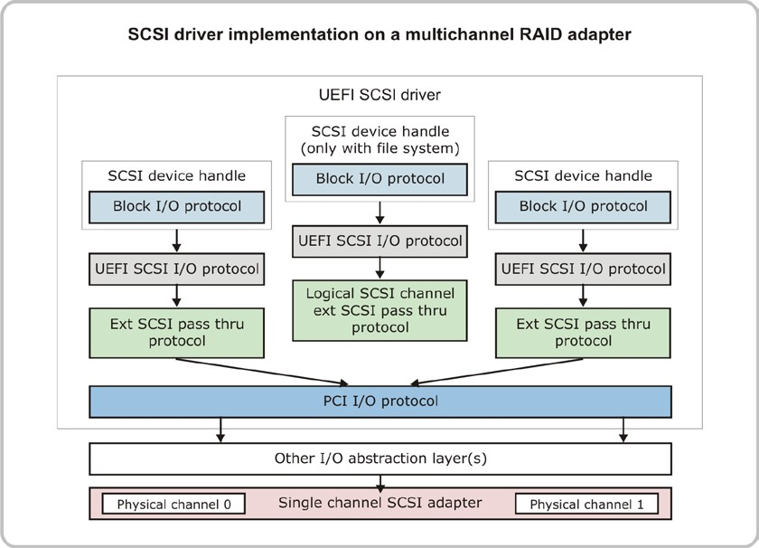

<!--- @file
  20.1.3 SCSI Adapters with RAID

  Copyright (c) 2012-2018, Intel Corporation. All rights reserved. 

  Redistribution and use in source (original document form) and 'compiled'
  forms (converted to PDF, epub, HTML and other formats) with or without
  modification, are permitted provided that the following conditions are met:

  1) Redistributions of source code (original document form) must retain the
     above copyright notice, this list of conditions and the following
     disclaimer as the first lines of this file unmodified.

  2) Redistributions in compiled form (transformed to other DTDs, converted to
     PDF, epub, HTML and other formats) must reproduce the above copyright
     notice, this list of conditions and the following disclaimer in the
     documentation and/or other materials provided with the distribution.

  THIS DOCUMENTATION IS PROVIDED BY TIANOCORE PROJECT "AS IS" AND ANY EXPRESS OR
  IMPLIED WARRANTIES, INCLUDING, BUT NOT LIMITED TO, THE IMPLIED WARRANTIES OF
  MERCHANTABILITY AND FITNESS FOR A PARTICULAR PURPOSE ARE DISCLAIMED. IN NO
  EVENT SHALL TIANOCORE PROJECT  BE LIABLE FOR ANY DIRECT, INDIRECT, INCIDENTAL,
  SPECIAL, EXEMPLARY, OR CONSEQUENTIAL DAMAGES (INCLUDING, BUT NOT LIMITED TO,
  PROCUREMENT OF SUBSTITUTE GOODS OR SERVICES; LOSS OF USE, DATA, OR PROFITS;
  OR BUSINESS INTERRUPTION) HOWEVER CAUSED AND ON ANY THEORY OF LIABILITY,
  WHETHER IN CONTRACT, STRICT LIABILITY, OR TORT (INCLUDING NEGLIGENCE OR
  OTHERWISE) ARISING IN ANY WAY OUT OF THE USE OF THIS DOCUMENTATION, EVEN IF
  ADVISED OF THE POSSIBILITY OF SUCH DAMAGE.

-->

### 20.1.3 SCSI Adapters with RAID

A SCSI host controller driver may also support SCSI adapters with RAID
capability. The following figure shows an example implementation with two
physical SCSI channels and one logical channel. The two physical channels are
implemented on the SCSI adapter. The RAID component then configures these two
channels to produce a logical SCSI channel. The two physical channels each have
Extended SCSI Pass Thru installed, but these are not be used except for
diagnostic use. For the logical channel, the SCSI host controller driver
produces another Extended SCSI Pass Thru Protocol (with physical bit turned
off) instance based on the RAID configuration. Requests sent to the Extended
SCSI Pass Thru protocol for the logical channel are processed by the SCSI host
controller drivers and converted into requests on the physical SCSI channels.
The platform firmware must only enumerate and boot from SCSI targets present on
the logical SCSI channel.

###### Figure 24-Sample SCSI driver implementation on multichannel RAID adapter

The SCSI adapter hardware may not be able to expose the physical SCSI
channel(s) to upper-level software when implementing RAID. If the physical SCSI
channel cannot be exposed to upper software, then the SCSI host controller
driver is only required to produce a single logical channel for the RAID.

Although the basic theory is the same as the one on a physical channel, it is
different from a manufacturing and diagnostic perspective. If the physical SCSI
channels are exposed, any SCSI command, including diagnostic ones, can be sent
to an individual channel, which is very helpful on manufacturing lines.
Furthermore, the diagnostic command can be sent simultaneously to all physical
channels using the non-blocking mode that is supported by Extended SCSI Pass
Thru Protocol. The diagnostic process may considerably benefit from the
performance gain. In summary, it is suggested to expose physical SCSI channel
whenever possible.

Of course, there are many possible designs for implementing SCSI RAID
functionality. The point is that an SCSI host controller driver may be designed
and implemented for a wide variety of SCSI adapters types, and those SCSI host
controller drivers can produce the Extended SCSI Pass Thru Protocol for SCSI
channels that contain SCSI targets that may be used as UEFI boot devices.
