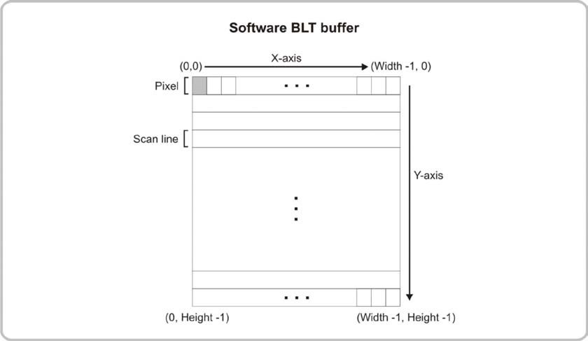

<!--- @file
  23.2.4 QueryMode(), SetMode(), and Blt() Implementation

  Copyright (c) 2012-2018, Intel Corporation. All rights reserved.<BR>

  Redistribution and use in source (original document form) and 'compiled'
  forms (converted to PDF, epub, HTML and other formats) with or without
  modification, are permitted provided that the following conditions are met:

  1) Redistributions of source code (original document form) must retain the
     above copyright notice, this list of conditions and the following
     disclaimer as the first lines of this file unmodified.

  2) Redistributions in compiled form (transformed to other DTDs, converted to
     PDF, epub, HTML and other formats) must reproduce the above copyright
     notice, this list of conditions and the following disclaimer in the
     documentation and/or other materials provided with the distribution.

  THIS DOCUMENTATION IS PROVIDED BY TIANOCORE PROJECT "AS IS" AND ANY EXPRESS OR
  IMPLIED WARRANTIES, INCLUDING, BUT NOT LIMITED TO, THE IMPLIED WARRANTIES OF
  MERCHANTABILITY AND FITNESS FOR A PARTICULAR PURPOSE ARE DISCLAIMED. IN NO
  EVENT SHALL TIANOCORE PROJECT  BE LIABLE FOR ANY DIRECT, INDIRECT, INCIDENTAL,
  SPECIAL, EXEMPLARY, OR CONSEQUENTIAL DAMAGES (INCLUDING, BUT NOT LIMITED TO,
  PROCUREMENT OF SUBSTITUTE GOODS OR SERVICES; LOSS OF USE, DATA, OR PROFITS;
  OR BUSINESS INTERRUPTION) HOWEVER CAUSED AND ON ANY THEORY OF LIABILITY,
  WHETHER IN CONTRACT, STRICT LIABILITY, OR TORT (INCLUDING NEGLIGENCE OR
  OTHERWISE) ARISING IN ANY WAY OUT OF THE USE OF THIS DOCUMENTATION, EVEN IF
  ADVISED OF THE POSSIBILITY OF SUCH DAMAGE.

-->

### 23.2.4 QueryMode(), SetMode(), and Blt() Implementation

There are three functions that make up one method: `QueryMode()`, `SetMode()`,
and `Blt()`. The mode pointer is pointing to a structure that has members so
that the consumer of the GOP protocol can get information about the current
state.

The `QueryMode()` function is used to return extended information on one of the
supported video modes. For example, the protocol consumer could iterate through
all of the valid video modes and see what they offer in terms of resolution,
color depth, etc. This function has no effect on the hardware or the currently
displayed image. It is critical that `QueryMode()` only return modes that can
actually be displayed on the attached display device. This means that the UEFI
Driver must evaluate the modes that that graphics controller supports and the
modes that the attached display supports and only reports the intersection of
those two sets. Otherwise, a consumer of the Graphics Output Protocol may
attempt to set a mode that cannot be displayed.

The `SetMode()` function is how the consumer of the Graphics Output Protocol
selected the specific mode to become active. `SetMode()` is also required to
clear the entire display output and reset it all to black.

The `Blt()` function is for transferring information (Block Transfer) to and
from the video frame buffer. This is how graphics content is moved to and from
the video frame buffer and also allows graphics content to be moved from one
location of the video frame buffer to another location of the video frame
buffer. The prototype of the `Blt()` function is shown below.

###### Example 232-Graphics Output Protocol Blt() Service

```c
/**
  Blt a rectangle of pixels on the graphics screen. Blt stands for BLock Transfer.
  
  @param  This          Protocol instance pointer.
  @param  BltBuffer     Buffer containing data to blit into video buffer. This buffer 
                        has a size of Width * Height * sizeof(EFI_GRAPHICS_OUTPUT_BLT_PIXEL)
  @param  BltOperation  Operation to perform on BlitBuffer and video memory
  @param  SourceX       X coordinate of source for the BltBuffer.
  @param  SourceY       Y coordinate of source for the BltBuffer.
  @param  DestinationX  X coordinate of destination for the BltBuffer.
  @param  DestinationY  Y coordinate of destination for the BltBuffer.
  @param  Width         Width of rectangle in BltBuffer in pixels.
  @param  Height        Hight of rectangle in BltBuffer in pixels. 
  @param  Delta         OPTIONAL
  
  @retval  EFI_SUCCESS            The Blt operation completed.
  @retval  EFI_INVALID_PARAMETER  BltOperation is not valid.
  @retval  EFI_DEVICE_ERROR       A hardware error occured writting to the video buffer.
**/

typedef
EFI_STATUS
(EFIAPI *EFI_GRAPHICS_OUTPUT_PROTOCOL_BLT)(
  IN EFI_GRAPHICS_OUTPUT_PROTOCOL          *This,
  IN EFI_GRAPHICS_OUTPUT_BLT_PIXEL         *BltBuffer, OPTIONAL
  IN EFI_GRAPHICS_OUTPUT_BLT_OPERATION     BltOperation,
  IN UINTN                                 SourceX,
  IN UINTN                                 SourceY,
  IN UINTN                                 DestinationX,
  IN UINTN                                 DestinationY,
  IN UINTN                                 Width,
  IN UINTN                                 Height,
  IN UINTN                                 Delta OPTIONAL 
  );
```

In this function the driver must translate the entire Blt operation into the
correct commands for the graphics adapter that it is managing. This can by be
done by performing PCI memory mapped I/O or port /IO operations or by
performing a DMA operation. The exact method is specific to the graphics
silicon.

A critical consideration of implementing the `Blt()` function is to get the
highest performance possible for the user. A common problem is that scrolling
the screen results in significant lags such that the user experiences a less
than optimal perception. This could be caused by the lags that are normally
present when reading back from the frame buffer. A possible solution is to have
a copy of the current frame buffer in a memory buffer for use in reads.

The screen is defined in terms of pixels and the buffer is formatted as
follows. For a given pixel at location X,Y the location in the buffer is
`Buffer[((Y*<<ScreenWidth>>)+X)]`. The screen is described according to the
following figure.

###### Figure 28-Software BLT Buffer



An important optimization to make in graphics drivers is for scrolling.
Scrolling is one of the most common operations to occur on a pre-boot graphics
adapter due to the common use of text based consoles. A method to scroll the
screen can be viewed in EDK II in the GraphicsConsole driver
(`\MdeModulePkg\Universal\Console\GraphicsConsoleDxe`).

The `EFI_GRAPHICS_OUTPUT_PROTOCOL_MODE` object pointed to by the `Mode` pointer
is populated when the graphics controller is initialized, and must be updated
whenever SetMode() is called. The FrameBufferBase member of this object may be
used by a UEFI OS Loader or OS Kernel to update the contents of the graphical display
after ExitBootServices() is called and the Graphics Output Protocol services
are not longer available. A UEFI OS may choose to use this method until an OS
driver for the graphics controller can be installed and started.
