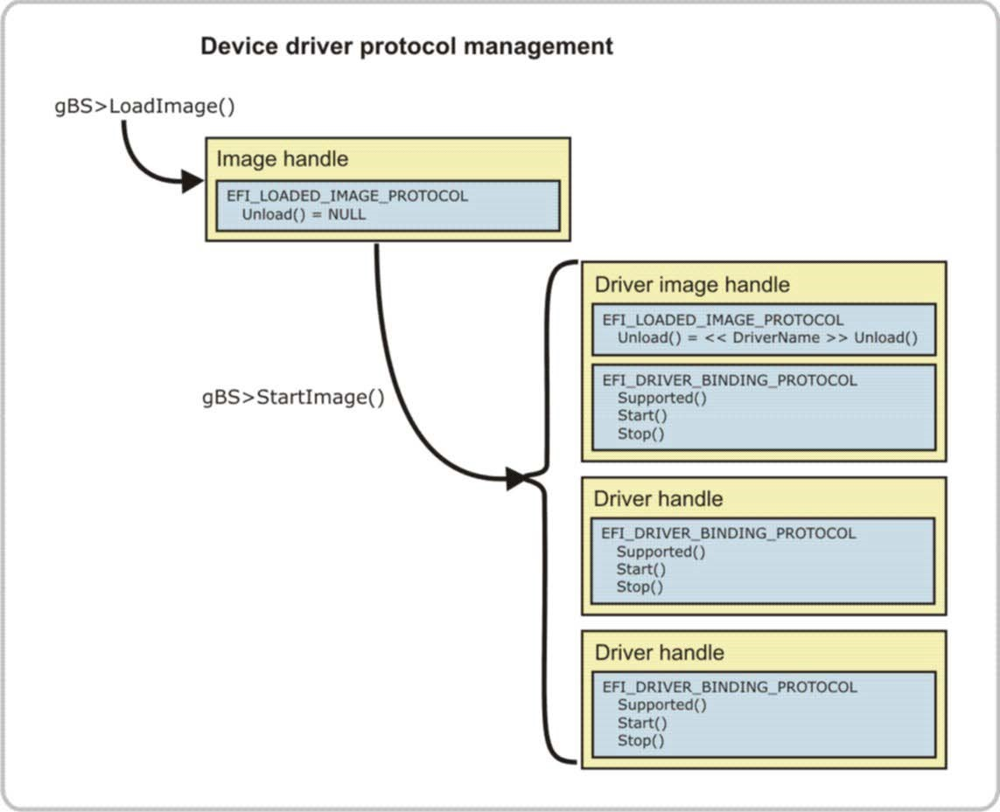

<!--- @file
  6.1.5 Device drivers with multiple driver binding protocols

  Copyright (c) 2012-2018, Intel Corporation. All rights reserved. 

  Redistribution and use in source (original document form) and 'compiled'
  forms (converted to PDF, epub, HTML and other formats) with or without
  modification, are permitted provided that the following conditions are met:

  1) Redistributions of source code (original document form) must retain the
     above copyright notice, this list of conditions and the following
     disclaimer as the first lines of this file unmodified.

  2) Redistributions in compiled form (transformed to other DTDs, converted to
     PDF, epub, HTML and other formats) must reproduce the above copyright
     notice, this list of conditions and the following disclaimer in the
     documentation and/or other materials provided with the distribution.

  THIS DOCUMENTATION IS PROVIDED BY TIANOCORE PROJECT "AS IS" AND ANY EXPRESS OR
  IMPLIED WARRANTIES, INCLUDING, BUT NOT LIMITED TO, THE IMPLIED WARRANTIES OF
  MERCHANTABILITY AND FITNESS FOR A PARTICULAR PURPOSE ARE DISCLAIMED. IN NO
  EVENT SHALL TIANOCORE PROJECT  BE LIABLE FOR ANY DIRECT, INDIRECT, INCIDENTAL,
  SPECIAL, EXEMPLARY, OR CONSEQUENTIAL DAMAGES (INCLUDING, BUT NOT LIMITED TO,
  PROCUREMENT OF SUBSTITUTE GOODS OR SERVICES; LOSS OF USE, DATA, OR PROFITS;
  OR BUSINESS INTERRUPTION) HOWEVER CAUSED AND ON ANY THEORY OF LIABILITY,
  WHETHER IN CONTRACT, STRICT LIABILITY, OR TORT (INCLUDING NEGLIGENCE OR
  OTHERWISE) ARISING IN ANY WAY OUT OF THE USE OF THIS DOCUMENTATION, EVEN IF
  ADVISED OF THE POSSIBILITY OF SUCH DAMAGE.

-->

### 6.1.5 Device drivers with multiple driver binding protocols

A more complex device driver is one that produces more than one instance of the
driver binding protocol. The first instance of `EFI_DRIVER_BINDING_PROTOCOL` is
installed onto the driver's image handle, and the additional instances of the
Driver Binding Protocol are installed onto newly created driver binding handles.

The figure below shows the state of the handle database before a driver is
loaded, before it is started, and after its driver entry point has been
executed. This specific driver produces three instances of the Driver Binding
Protocol.

###### Figure 11-Device driver with multiple driver binding protocols

Any device driver that produces multiple instances of the
`EFI_DRIVER_BINDING_PROTOCOL` can be broken up into multiple drivers. Each
driver would then produce a single instance of the
`EFI_DRIVER_BINDING_PROTOCOL`. However, there are advantages if a driver
produces multiple instances of the Driver Binding Protocol.

First, it may reduce the overall size of the drivers. If two related drivers
are combined, and those two drivers can share internal functions, the
executable image size of the single driver may be smaller than the sum of the
two individual drivers.

Combining drivers can also help manage platform features. A single platform's
features may require several drivers. If the drivers are separate, multiple
drivers have to be dealt with individually to add or remove that single feature.

An example device driver in EDK II that produces multiple instances of the
Driver Binding Protocol is the console platform driver in the
`MdeModulePkg/Universal/Console/ConPlatformDxe` subdirectory. This driver
implements the platform policy for managing multiple console input and output
devices. It produces one Driver Binding Protocol for the console output
devices, and another Driver Binding Protocol for the console input devices. The
management of console devices needs to be centralized, so it makes sense to
combine these two functions into a single driver so
the platform vendor needs to update only one driver to adjust the platform
policy for managing console devices.
